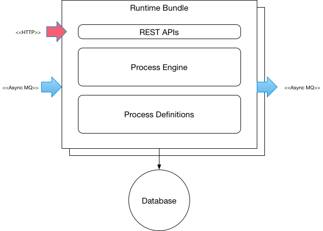

# Runtime Bundle

Runtime Bundle is the Cloud version of the Process Engine. If you ever exposed Activiti \(the process engine\) as a service, you were defining a Runtime Bundle. 

But there are some extra things that you need to know about Runtime Bundles:

* Runtime Bundles in the context of Activiti Cloud represent a stateless instance of the process engine which is in charge of executing an immutable set of process definitions.
* You cannot deploy new process definitions to a Runtime Bundle, instead you will create a new immutable version of your Runtime Bundle if you  want to update your process definitions.
* Runtime Bundles expose a \(Sync\) REST and \(Async\) Message Based API to interact with them.
* Runtime Bundles emit events \(in a fire & forget fashion\) using a set of implementations of the internal [ActivitiEventListener](https://github.com/Activiti/Activiti/tree/39e0d2bde9ef79ba3c38d04e3c5c2e8cc8a3a983/activiti-api-impl/activiti-api-process-runtime-impl/src/main/java/org/activiti/runtime/api/event/internal) interface. \(Listen to the internal Process Engine events and transform them into messages containing [all the events generated inside a transaction](https://github.com/Activiti/activiti-cloud-runtime-bundle-service/blob/develop/activiti-cloud-services-runtime-bundle/activiti-cloud-services-events/src/main/java/org/activiti/cloud/services/events/listeners/BaseCommandContextEventsAggregator.java) \)
* Runtime Bundles, by default when executing Service Tasks \(BPMN\), will emit Integration Events to perform System to System integration. These Integration Events will be picked up by Activiti Cloud Connectors to perform system to system integrations.



## REST APIs \(HAL\)

Runtime Bundles expose a REST API with the following **user** (**ACTIVITI_USER** role) endpoints:

* [v1/process-definitions](https://github.com/Activiti/activiti-cloud-runtime-bundle-service/blob/develop/activiti-cloud-services-runtime-bundle/activiti-cloud-services-rest-api/src/main/java/org/activiti/cloud/services/rest/api/ProcessDefinitionController.java)
* [v1/process-definition/{id}/meta](https://github.com/Activiti/activiti-cloud-runtime-bundle-service/blob/develop/activiti-cloud-services-runtime-bundle/activiti-cloud-services-rest-api/src/main/java/org/activiti/cloud/services/rest/api/ProcessDefinitionMetaController.java)
* [v1/process-instances/](https://github.com/Activiti/activiti-cloud-runtime-bundle-service/blob/develop/activiti-cloud-services-runtime-bundle/activiti-cloud-services-rest-api/src/main/java/org/activiti/cloud/services/rest/api/ProcessInstanceController.java)
* [v1/process-instances/{id}/tasks](https://github.com/Activiti/activiti-cloud-runtime-bundle-service/blob/develop/activiti-cloud-services-runtime-bundle/activiti-cloud-services-rest-api/src/main/java/org/activiti/cloud/services/rest/api/ProcessInstanceTasksController.java)
* [v1/process-instances/{id}/variables](https://github.com/Activiti/activiti-cloud-runtime-bundle-service/blob/develop/activiti-cloud-services-runtime-bundle/activiti-cloud-services-rest-api/src/main/java/org/activiti/cloud/services/rest/api/ProcessInstanceVariableController.java)
* [v1/tasks](https://github.com/Activiti/activiti-cloud-runtime-bundle-service/blob/develop/activiti-cloud-services-runtime-bundle/activiti-cloud-services-rest-api/src/main/java/org/activiti/cloud/services/rest/api/TaskController.java)
* [v1/tasks/{id}/variables](https://github.com/Activiti/activiti-cloud-runtime-bundle-service/blob/develop/activiti-cloud-services-runtime-bundle/activiti-cloud-services-rest-api/src/main/java/org/activiti/cloud/services/rest/api/TaskVariableController.java)

Also the following **admin** (**ACTIVITI_ADMIN** role) endpoints:

* [admin/v1/process-definitions/](https://github.com/Activiti/activiti-cloud-runtime-bundle-service/blob/develop/activiti-cloud-services-runtime-bundle/activiti-cloud-services-rest-api/src/main/java/org/activiti/cloud/services/rest/api/ProcessDefinitionAdminController.java)
* [admin/v1/process-instances](https://github.com/Activiti/activiti-cloud-runtime-bundle-service/blob/develop/activiti-cloud-services-runtime-bundle/activiti-cloud-services-rest-api/src/main/java/org/activiti/cloud/services/rest/api/ProcessInstanceAdminController.java)
* [admin/v1/tasks](https://github.com/Activiti/activiti-cloud-runtime-bundle-service/blob/develop/activiti-cloud-services-runtime-bundle/activiti-cloud-services-rest-api/src/main/java/org/activiti/cloud/services/rest/api/TaskAdminController.java)

## \(Async\) Command Based Interactions

Commands are defined as **Payloads** in the new [Java Core API layer](https://github.com/Activiti/activiti-api/tree/develop/activiti-api-process-model/src/main/java/org/activiti/api/process/model/payloads). These Payloads contains information to execute different actions implemented inside the process engine and they will return a Result if the execution generated data. When these Commands are executed by the Message Endpoints the results will be sent to a different queue.

These commands are processed by the [CommandEndpoint](https://github.com/Activiti/activiti-cloud-runtime-bundle-service/blob/develop/activiti-cloud-services-runtime-bundle/activiti-cloud-services-core/src/main/java/org/activiti/cloud/services/core/commands/CommandEndpoint.java) which delegate the operation to more specific [Executors for each Command](https://github.com/Activiti/activiti-cloud-runtime-bundle-service/tree/develop/activiti-cloud-services-runtime-bundle/activiti-cloud-services-core/src/main/java/org/activiti/cloud/services/core/commands)

* _Commands Payloads_ \(implements [Payload](https://github.com/Activiti/activiti-api/blob/develop/activiti-api-model-shared/src/main/java/org/activiti/api/model/shared/Payload.java)\)

Process Related Payloads:

  * [StartProcessPayLoad](https://github.com/Activiti/activiti-api/blob/develop/activiti-api-process-model/src/main/java/org/activiti/api/process/model/payloads/StartProcessPayload.java)
    * id
    * processDefinitionId
    * processDefinitionKey
    * processInstanceName
    * businessKey
    * variables [Map]
  * [SuspendProcessPayload](https://github.com/Activiti/activiti-api/blob/develop/activiti-api-process-model/src/main/java/org/activiti/api/process/model/payloads/SuspendProcessPayload.java)
    * id
    * processDefinitionId
  * [ResumeProcessPayload](https://github.com/Activiti/activiti-api/blob/develop/activiti-api-process-model/src/main/java/org/activiti/api/process/model/payloads/ResumeProcessPayload.java)
    * id
    * processDefinitionId
  * [SignalPayload](https://github.com/Activiti/activiti-api/blob/develop/activiti-api-process-model/src/main/java/org/activiti/api/process/model/payloads/SignalPayload.java)
    * id
    * name
    * variables
  * [SetProcessVariables](https://github.com/Activiti/activiti-api/blob/develop/activiti-api-process-model/src/main/java/org/activiti/api/process/model/payloads/SetProcessVariablesPayload.java)
    * id
    * processInstanceId
    * variables [Map]
    * localOnly
  * [DeleteProcessPayload](https://github.com/Activiti/activiti-api/blob/develop/activiti-api-process-model/src/main/java/org/activiti/api/process/model/payloads/DeleteProcessPayload.java)  
    * id
    * processInstanceId
  * [RemoveProcessVariablesPayload](https://github.com/Activiti/activiti-api/blob/develop/activiti-api-process-model/src/main/java/org/activiti/api/process/model/payloads/RemoveProcessVariablesPayload.java) 
    * id
    * processInstanceId
 
 Task Related Payloads:
    
  * [ClaimTaskPayload](https://github.com/Activiti/activiti-api/blob/develop/activiti-api-task-model/src/main/java/org/activiti/api/task/model/payloads/ClaimTaskPayload.java)
  * [ReleaseTaskPayload](https://github.com/Activiti/activiti-api/blob/develop/activiti-api-task-model/src/main/java/org/activiti/api/task/model/payloads/ReleaseTaskPayload.java)
  * [CompleteTaskPayload](https://github.com/Activiti/activiti-api/blob/develop/activiti-api-task-model/src/main/java/org/activiti/api/task/model/payloads/CompleteTaskPayload.java)
    * inputVariables
  * [SetTaskVariablePayload](https://github.com/Activiti/activiti-api/blob/develop/activiti-api-task-model/src/main/java/org/activiti/api/task/model/payloads/SetTaskVariablesPayload.java)
    * taskId
    * variables
  * [DeleteTaskPayload](https://github.com/Activiti/activiti-api/blob/develop/activiti-api-task-model/src/main/java/org/activiti/api/task/model/payloads/DeleteTaskPayload.java)
  * [UpdateTaskPayload](https://github.com/Activiti/activiti-api/blob/develop/activiti-api-task-model/src/main/java/org/activiti/api/task/model/payloads/UpdateTaskPayload.java)

## Message Enabled

By design a Runtime Bundle is enabled to consume and produce \(async\) messages. This is achieved by using Spring Cloud Streams to consume Commands operations or emit Events representing the internal process engine operations.

_Notice that a Runtime Bundle, by design, doesn't have WebSockets/Push Notifications built in._

Events are emitted by the process engine using a message queue so external components can react to them. All these events implements the [org.activiti.services.core.model.events.ProcessEngineEvent](https://github.com/Activiti/activiti-cloud-runtime-bundle-service/blob/master//activiti-cloud-services-runtime-bundle/activiti-cloud-services-api/src/main/java/org/activiti/cloud/services/api/events/ProcessEngineEvent.java) interface.

These events can be found in the [activiti-cloud-services-events](https://github.com/Activiti/activiti-cloud-runtime-bundle-service/blob/master/activiti-cloud-services-runtime-bundle/activiti-cloud-services-events/) module.

* [ActivityStartedEvent](https://github.com/Activiti/activiti-cloud-runtime-bundle-service/blob/master/activiti-cloud-services-runtime-bundle/activiti-cloud-services-events/src/main/java/org/activiti/cloud/services/events/ActivityStartedEvent.java)
* [ActivityCompletedEvent](https://github.com/Activiti/activiti-cloud-runtime-bundle-service/blob/master/activiti-cloud-services-runtime-bundle/activiti-cloud-services-events/src/main/java/org/activiti/cloud/services/events/ActivityCompletedEvent.java)
* [ProcessStartedEvent](https://github.com/Activiti/activiti-cloud-runtime-bundle-service/blob/master/activiti-cloud-services-runtime-bundle/activiti-cloud-services-events/src/main/java/org/activiti/cloud/services/events/ProcessStartedEvent.java)
* [ProcessCompletedEvent](https://github.com/Activiti/activiti-cloud-runtime-bundle-service/blob/master/activiti-cloud-services-runtime-bundle/activiti-cloud-services-events/src/main/java/org/activiti/cloud/services/events/ProcessCompletedEvent.java)
* [TaskCreatedEvent](https://github.com/Activiti/activiti-cloud-runtime-bundle-service/blob/master/activiti-cloud-services-runtime-bundle/activiti-cloud-services-events/src/main/java/org/activiti/cloud/services/events/TaskCreatedEvent.java)
* [TaskAssignedEvent](https://github.com/Activiti/activiti-cloud-runtime-bundle-service/blob/master/activiti-cloud-services-runtime-bundle/activiti-cloud-services-events/src/main/java/org/activiti/cloud/services/events/TaskAssignedEvent.java)
* [TaskCompletedEvent](https://github.com/Activiti/activiti-cloud-runtime-bundle-service/blob/master/activiti-cloud-services-runtime-bundle/activiti-cloud-services-events/src/main/java/org/activiti/cloud/services/events/TaskCompletedEvent.java)
* [VariableCreatedEvent](https://github.com/Activiti/activiti-cloud-runtime-bundle-service/blob/master/activiti-cloud-services-runtime-bundle/activiti-cloud-services-events/src/main/java/org/activiti/cloud/services/events/VariableCreatedEvent.java)
* [VariableUpdatedEvent](https://github.com/Activiti/activiti-cloud-runtime-bundle-service/blob/master/activiti-cloud-services-runtime-bundle/activiti-cloud-services-events/src/main/java/org/activiti/cloud/services/events/VariableUpdatedEvent.java)
* [VariableDeletedEvent](https://github.com/Activiti/activiti-cloud-runtime-bundle-service/blob/master/activiti-cloud-services-runtime-bundle/activiti-cloud-services-events/src/main/java/org/activiti/cloud/services/events/VariableDeletedEvent.java)
* [SequenceFlowTakenEvent](https://github.com/Activiti/activiti-cloud-runtime-bundle-service/blob/master/activiti-cloud-services-runtime-bundle/activiti-cloud-services-api/src/main/java/org/activiti/cloud/services/events/SequenceFlowTakenEvent.java)

### Not covered Yet

* ActivityCancelledEvent
* ActivityCompensateEvent
* ProcessCompletedErrorEvent

## Runtime Bundle Data Types

Runtime Bundles work and expose the following data types \([org.activiti.services.api.model](https://github.com/Activiti/activiti-cloud-runtime-bundle-service/tree/develop/activiti-cloud-services-runtime-bundle/activiti-cloud-services-api/src/main/java/org/activiti/cloud/services/api/model)\):

* [ProcessDefinition](https://github.com/Activiti/activiti-cloud-runtime-bundle-service/blob/master/activiti-cloud-services-runtime-bundle/activiti-cloud-services-api/src/main/java/org/activiti/cloud/services/api/model/ProcessDefinition.java)
  * id
  * name
  * description
  * version
* [ProcessInstance](https://github.com/Activiti/activiti-cloud-runtime-bundle-service/blob/master/activiti-cloud-services-runtime-bundle/activiti-cloud-services-api/src/main/java/org/activiti/cloud/services/api/model/ProcessInstance.java)
  * id
  * name
  * description
  * processDefinitionId
  * initiator
  * startDate
  * businessKey
  * status
* [Task](https://github.com/Activiti/activiti-cloud-runtime-bundle-service/blob/master/activiti-cloud-services-runtime-bundle/activiti-cloud-services-api/src/main/java/org/activiti/cloud/services/api/model/Task.java)
  * id
  * owner
  * assignee
  * name
  * description
  * createdDate
  * claimedDate
  * dueDate
  * priority
  * processDefinitionId
  * processInstanceId
  * parentTaskId
  * status
* [ProcessInstanceVariables](https://github.com/Activiti/activiti-cloud-runtime-bundle-service/blob/master/activiti-cloud-services-runtime-bundle/activiti-cloud-services-api/src/main/java/org/activiti/cloud/services/api/model/ProcessInstanceVariables.java)
  * processInstanceId
  * variables \(Map\)
* [TaskVariables](https://github.com/Activiti/activiti-cloud-runtime-bundle-service/blob/master/activiti-cloud-services-runtime-bundle/activiti-cloud-services-api/src/main/java/org/activiti/cloud/services/api/model/TaskVariables.java)
  * taskId
  * variables \(Map\)
  * scope
* [ProcessDefinitionMeta](https://github.com/Activiti/activiti-cloud-runtime-bundle-service/blob/master/activiti-cloud-services-runtime-bundle/activiti-cloud-services-api/src/main/java/org/activiti/cloud/services/api/model/ProcessDefinitionMeta.java)
* [ProcessDefinitionUserTask](https://github.com/Activiti/activiti-cloud-runtime-bundle-service/blob/master/activiti-cloud-services-runtime-bundle/activiti-cloud-services-api/src/main/java/org/activiti/cloud/services/api/model/ProcessDefinitionUserTask.java)
* [ProcessDefinitionServiceTask](https://github.com/Activiti/activiti-cloud-runtime-bundle-service/blob/master/activiti-cloud-services-runtime-bundle/activiti-cloud-services-api/src/main/java/org/activiti/cloud/services/api/model/ProcessDefinitionServiceTask.java)

## Requirements

Runtime Bundles then require the following list of infrastructural services:

* SSO / IDM service for handling Security and User/Groups resolutions
* Message Broker to emit and consume messages
* Database to store the state of the process instances and tasks

## Security

In addition to authorization at endpoint-level provided through an external authorization system \(and in the case of Keycloak configured in a properties file\), individual process definitions \(and implicitly process instances\) within a runtime bundle can have ACLs applied. These are applied via a properties file using a format such as:

```text
activiti.cloud.security.user.testuser.runtime-bundle.policy.read=process_pool1,ProcessWithVariables
activiti.cloud.security.group.hr.runtime-bundle.policy.write=process_pool1,ProcessWithVariables,SimpleProcess,ProcessWithVariables2,ProcessWithBoundarySignal
```

Or environment variables can be used such as:

`ACTIVITI_CLOUD_SECURITY_USER_HRUSER_RBMYAPP_POLICY_WRITE=SimpleProcess` `ACTIVITI_CLOUD_SECURITY_GROUP_HR_RBMYAPP_POLICY_WRITE=SimpleProcess` `ACTIVITI_CLOUD_SECURITY_GROUP_TESTGROUP_RBMYAPP_POLICY_WRITE=*`

## Source Code & Docker Image

* [Runtime Bundle -&gt; Source Code](https://github.com/activiti/activiti-cloud-runtime-bundle) Here you can find a Runtime Bundle example that you can use as the starting point to build your domain specific Runtime Bundles. This project was built using the [Runtime Bundle Starter that you can find here](https://github.com/Activiti/activiti-cloud-runtime-bundle-service/tree/develop/activiti-cloud-starter-runtime-bundle).
* [Runtime Bundle -&gt; Docker Image](https://hub.docker.com/r/activiti/activiti-cloud-runtime-bundle/)

