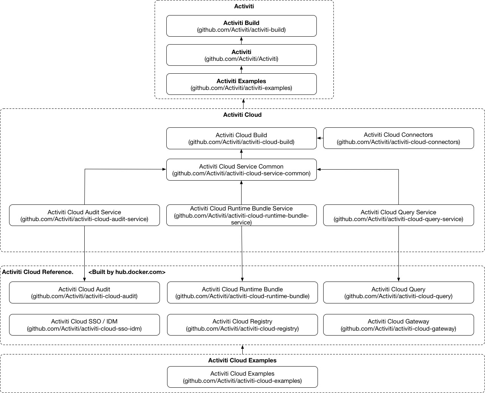

# Repositories Structure

The following diagram shows our current repository structure that might expand into the future, but the basic structure is going to probably remain unchanged.



## Main \(Maven\) Artifacts

In the previous diagram there are 4 dashed boxes which contain several repositories each Activiti, Activiti Cloud, Activiti Cloud Reference and Activiti Cloud Examples. The first layer is Activiti which includes the Build projects, Process Engine Runtime and examples. At this level we just depend on Java JDK 8. Inside the Activiti repository we have [activiti-spring](repositories.md) which serves as the basic integration against Spring 5 \(version which is defined inside the Build parent project\). Activiti relies on \[activiti-parent\] for 3rd party libraries dependency management. We are making sure that we deal with 3rd party dependencies and their versions in our parent poms, so it is completely forbidden to add version definitions in submodules.

Inside the [Activiti Build](https://github.com/activiti/activiti-build) repository we are also providing the [BOM \(Bill of Materials - activiti-dependencies\)](https://github.com/Activiti/activiti-build/blob/develop/activiti-dependencies/pom.xml) that you can import into your projects for maven to handle all the dependencies version for you. This will enable us to refactor Activiti’s internal modules without affecting applications depending on specific modules, so we recommend to use these activiti-dependencies whenever possible.

```text
<dependencyManagement>
 <dependencies>
   <dependency>
     <groupId>org.activiti</groupId>
     <artifactId>activiti-dependencies</artifactId>
     <version>${activiti.version}</version>
     <type>pom</type>
     <scope>import</scope>
   </dependency>
 </dependencies>
</dependencyManagement>
```

Moving down in the hierarchy we find Activiti Cloud which represent our Spring Cloud enabled services. These services were designed to run in a Cloud Native way and for that reason they will use abstraction layers provided by Spring Cloud. All the services are independent from each other and we will try to keep base dependencies as decoupled as possible, but they do share the same parent which specifies the spring boot and spring cloud versions that they all use.

We also have our [BOM for Activiti Cloud](https://github.com/activiti/activiti-cloud-build) that you can include in your projects to deal with dependencies of several starters and services in a centralised way:

```text
<dependencyManagement>
  <dependencies>
    <dependency>
      <groupId>org.activiti.cloud</groupId>
      <artifactId>activiti-cloud-dependencies</artifactId>
      <version>${activiti.cloud.version}</version>
      <type>pom</type>
      <scope>import</scope>
    </dependency>
  </dependencies>
</dependencyManagement>
```

There are also some cross-cutting concerns that also need to be added to each of our individual services such as security and utilities for testing. For that reason we have created a repository called [activiti-cloud-service-common](https://github.com/activiti/activiti-cloud-service-common), which contains these shared cross-cutting features that are likely to be adopted by most of our services.

If you take a look at the following repositories \(this list is likely to grow quite a lot\):

* [Activiti Cloud Runtime Bundle Service](https://github.com/activiti/activiti-cloud-runtime-bundle-service)
* [Activiti Cloud Audit Service](https://github.com/activiti/activiti-cloud-audit-service)
* [Activiti Cloud Query Service](https://github.com/activiti/activiti-cloud-query-service)

You will find that in all of them we include two types of projects:

* Base \(Core\) Services: here you will find the core business logic of our services. This translate to -model, -core and other utilities modules that can be glued together to provide a well defined set of features.
* Spring Boot Starters: here you will find the spring boot starters that you can add to your spring boot apps to automatically configure the services to be used inside your app. Starters usually provide annotations to trigger those auto configurations.

The base core services provides the business logic for each of these modules and Spring Starters allows you to add a simple dependency to your spring boot application to enable the functionality provided by the base core services to your spring boot app. We usually also provide some AutoConfigurations and annotations to make sure that our base core services are easy to bootstrap.

We recommend our community members to build Services & Starters at this level. If you, for example, want to tap into events emited by the process engine, writing a service that consume those messages and execute some business logic should be trivial using Spring Cloud.

Until this point \(everything inside\) Activiti and Activiti Cloud will be released and available in [Maven Central](http://search.maven.org/#search|ga|1|activiti-cloud) as maven artifacts. We will release Early Access builds every month until we have enough meat for a Beta release. We did our first EA release for the first time at the end of August 17, and we will do a our next one by the end of October.

## Reference Docker Images & Examples

If you go down another level in the previous diagram, you will see a set of repositories which are being built by hub.docker.com using the automated build configuration. These repositories contain reference implementations using our spring boot starters of each of our services. By using these images you can get a basic working setup of all the services.

These docker images are being tagged every month when we go through our release process, in our examples we always point to the latest build \(which happens after every commit to these repositories\).

These Docker Images are used to provide examples about how to deploy all these services using [Docker Compose](https://docs.docker.com/compose/), [Kubernetes](http://kubernetes.io), and Kubernetes HELM charts. You can find these examples inside the [activiti-cloud-examples](https://github.com/activiti/activiti-cloud-examples) repository.

You, as a user, are encouraged to generate your own Docker images with your required customizations. We have tried to keep these images as simple as possible.

## Open Pull Requests at Organization level

[https://github.com/pulls?utf8=✓&q=is%3Aopen+is%3Apr+user%3AActiviti+archived%3Afalse+](https://github.com/pulls?utf8=✓&q=is%3Aopen+is%3Apr+user%3AActiviti+archived%3Afalse+)

## Open Issues at Organization level

[https://github.com/issues?utf8=✓&q=is%3Aopen+is%3Aissue+user%3AActiviti+archived%3Afalse+](https://github.com/issues?utf8=✓&q=is%3Aopen+is%3Aissue+user%3AActiviti+archived%3Afalse+)

